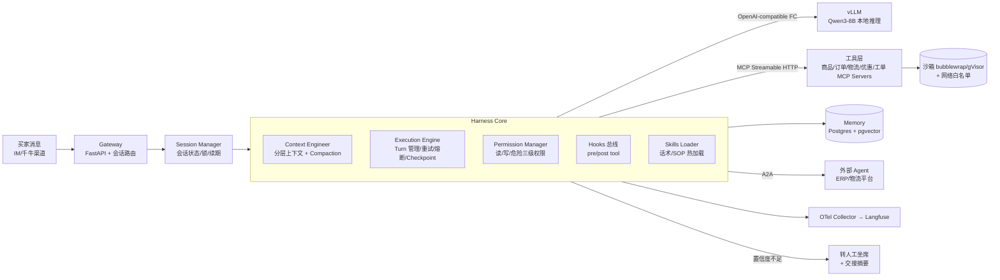
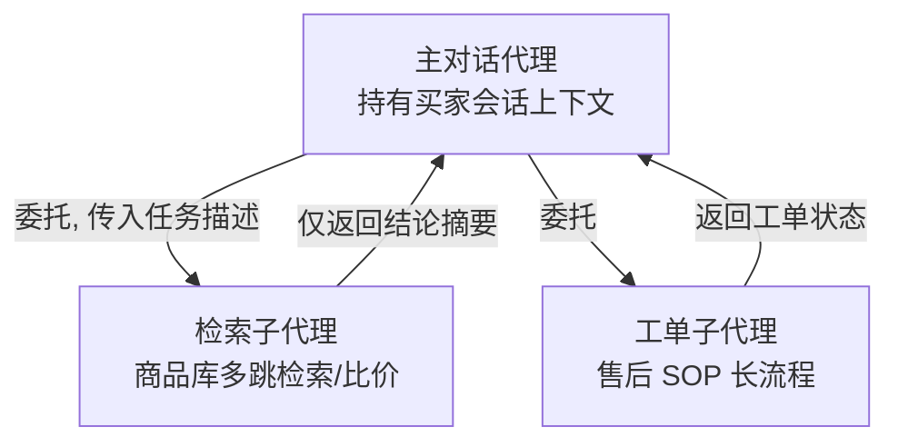
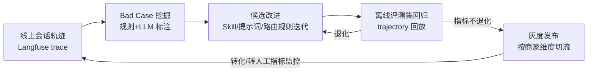

# ShopHarness —— 面向电商客服场景的 Agent Harness 设计文档

> 一句话定位：**一个让 Qwen3-8B 在电商商家客服场景打出"大模型级"效果的 Agent Harness（脚手架）**。
> 模型可换，Harness 才是核心竞争力。

- 目标读者：Agent 研发/算法岗位面试官、协作工程师
- 状态：设计稿（v1.0），2026-07
- 运行环境：单机本地部署（GPU ≥ 16GB 显存即可跑 FP8/Q4 量化的 Qwen3-8B）

---

## 1. 项目概述与动机

### 1.1 为什么做 Harness 方向

2025–2026 年 Agent 领域的共识逐渐清晰：**基座模型趋同，差异在 Harness**。所谓 Harness，是包裹在 LLM 外围的一整套工程系统——上下文工程、工具调用协议、执行引擎、权限与隔离、记忆、评测与数据飞轮。Claude Code、Kimi Code、Devin 等产品的护城河都不在模型，而在 Harness。

电商商家客服是 Harness 价值的最佳试炼场：

- **长上下文压力**：一次询单会话动辄几十轮，夹杂商品检索、订单查询、优惠信息等工具结果，8B 模型的 32K 上下文很快吃紧——逼出真正的上下文压缩（compaction）设计。
- **强工具依赖**：查商品、查订单、查物流、算优惠、建工单、改备注，Function Calling 的准确率直接决定转人工率。
- **可量化北极星指标**：询单转化率、转人工率、响应延迟，都是商家真金白银的指标，方便做评测和自进化闭环。
- **安全红线清晰**：改价、退款属于"危险工具"，天然需要权限模型和沙箱。

### 1.2 为什么 8B 本地部署

| 维度 | 说明 |
| --- | --- |
| 成本 | 商家客服 QPS 不高但 7×24 在线，本地 8B 推理成本远低于调用云端大模型 API |
| 合规 | 订单、手机号、地址等 PII 不出商家机房，满足数据合规 |
| 可控 | 本地权重可做 SFT/DPO/Agentic RL 等 post-training，形成"数据飞轮"，这是纯 API 方案做不到的 |
| 研究价值 | 8B 模型能力有限，反而最能体现 Harness 设计的功力——好 Harness 补模型短板 |

### 1.3 北极星指标

| 指标 | 定义 | 目标（相对人工/基线） |
| --- | --- | --- |
| 询单转化率 | 咨询后 24h 内下单的会话占比 | 不低于人工基线的 90% |
| 转人工率 | 会话中被转接人工的占比 | ≤ 25%（行业常见基线 40%+） |
| 单轮平均 token 成本 | 每轮对话的输入+输出 token 数 | 压缩后较朴素方案降 ≥ 40% |
| P99 首 token 延迟 | 用户发消息到首 token 返回 | ≤ 2s（本地 vLLM，单并发） |
| 危险操作零事故率 | 改价/退款等写操作错误次数 | 0 |

---

## 2. 技术选型（截至 2026 年 7 月）

| 层 | 选型 | 理由 |
| --- | --- | --- |
| 模型 | **Qwen3-8B**（本地权重，FP8 或 AWQ-Q4 量化） | 原生混合推理（`/think`、`/no_think` 动态开关）、Function Calling 能力强、中文电商语料覆盖好 |
| 推理服务 | **vLLM 0.25+**（2026-07 stable） | continuous batching、automatic prefix caching（重复 system prompt 近零成本）、`--tool-call-parser hermes` + `--reasoning-parser qwen3` 内置支持 |
| 运行时 | **Python 3.13 + uv**，Pydantic v2，FastAPI | uv 管理依赖与虚拟环境；Pydantic v2 做全链路 schema 校验 |
| 工具协议 | **MCP（Streamable HTTP 传输）**，FastMCP 2.x 开发工具 Server | 2026 年 MCP 已是工具层事实标准；Streamable HTTP 替代早期 SSE，支持无状态水平扩展 |
| 多 Agent 互通 | **A2A 协议**（Agent2Agent） | 与外部系统（商家 ERP Agent、平台物流 Agent）互通的标准协议；本项目实现 A2A Server 暴露"客服 Agent"能力卡 |
| 模型侧工具调用 | OpenAI-compatible Function Calling（经 vLLM） | 与 MCP 解耦：MCP 管工具供给，Function Calling 管模型决策 |
| 编排 | **自研轻量 Harness Loop**（ReAct/Plan-Act 混合）+ **LangGraph** 承载长程有状态流程 | 主对话用自研 loop 保持可控与可解释；售后工单等长流程用 LangGraph 的 checkpoint/中断恢复 |
| 记忆 | **PostgreSQL 16 + pgvector**（语义记忆）+ 结构化业务库（商品/订单/物流） | 单库承载事务与向量检索，减少组件 |
| 检索 | BM25（PG 全文/tsvector 或独立 rank_bm25）+ pgvector 向量召回，RRF 融合 | 混合检索在电商 SKU/货号类查询上显著优于纯向量 |
| 可观测性 | **OpenTelemetry GenAI Semantic Conventions** + **Langfuse** | OTel GenAI 约定已成行业标准；Langfuse 做 trace 可视化、人工评分、prompt 版本管理 |
| 隔离 | 工具沙箱：**bubblewrap**（轻量）/ 容器化部署时换 **gVisor**；出口网络白名单 | 对应 JD"资源隔离、网络访问控制" |
| 评测 | 自研 **trajectory 评测框架** + 离线回放（har 式会话录制重放） | 对话 Agent 没有标准答案，必须评"轨迹"而非单条输出 |

版本说明：vLLM/MCP/A2A/Langfuse 在 2026 年迭代极快，文中版本号为设计时验证过的下限，实际部署取当时最新 stable。

---

## 3. Harness 核心架构（重点）

### 3.1 总体架构

### 3.2 Context Engineering：8B 模型的生死线

8B 模型上下文短、抗噪能力弱，上下文工程是本 Harness 投入最大的模块。

**分层上下文预算**（以 32K 为例，动态可调）：

| 层 | 预算 | 内容 |
| --- | --- | --- |
| L0 System | 2K | 角色、红线、当前启用的 Skill 指令（精简版） |
| L1 业务知识 | 4K | 本轮检索到的商品卡/FAQ 片段（子代理已做摘要） |
| L2 会话状态 | 1K | 结构化状态：当前意图、已确认事项、待办（Pydantic 模型序列化） |
| L3 会话历史 | 其余 | 原始对话，超预算触发 compaction |
| L4 工具结果 | 并入 L3 | 大型工具结果（如订单列表）落盘存引用，上下文只留摘要+指针 |

**Compaction 策略**（三级，按压力递进）：

1. **工具结果瘦身**：工具返回超过阈值即替换为"摘要 + artifact 引用"，原文可随时再取。
2. **滑窗 + 结构化事实抽取**：丢弃中间轮次原文，但先由模型抽取"买家已确认的收货地址/看中的 SKU/价格承诺"等关键事实写入 L2——事实不丢，原文可丢。
3. **全量摘要**：长会话（如跨天售后）整体压缩为摘要段落，保留最近 N 轮原文。

关键设计：**compaction 由 Harness 触发而非模型自觉**，触发点、保留策略对模型透明，保证行为可复现、可评测。

### 3.3 工具系统

- **MCP 工具层**：商品检索、订单查询、物流跟踪、优惠计算、工单创建、备注修改各为独立 MCP Server，Streamable HTTP 传输，可独立部署/替换。
- **三级权限模型**：

| 级别 | 示例 | Harness 行为 |
| --- | --- | --- |
| 读 | 查商品/订单/物流 | 直接执行 |
| 写（可逆） | 加备注、发优惠券 | 执行 + 记录审计日志 |
| 危险（不可逆/涉钱） | 改价、退款、关闭订单 | pre-tool hook 强制"向买家复述确认" + 置信度门槛，未过则转人工 |

- **Schema 注入策略**：8B 模型塞不下几十个工具的完整 schema。Harness 按当前意图路由**动态裁剪工具集**（售前只挂商品/优惠类），并将工具描述压缩为短句。工具检索本身也可做成一个 `search_tools` 元工具。

### 3.4 执行引擎

- **Turn 管理**：一次用户消息 → 一轮"模型决策 ↔ 工具执行"循环，设最大步数与墙钟超时，防止 8B 模型陷入无效工具循环。
- **错误恢复**：工具超时/5xx 指数退避重试；模型输出非法 tool_call 时，Harness 注入结构化错误反馈让其自我纠正（一次），再失败降级到转人工。
- **Checkpoint**：每个 turn 结束持久化会话状态（Postgres），进程崩溃/重启后从最近 checkpoint 恢复，支持长程售后流程跨天续跑（LangGraph checkpointer 承载）。
- **熔断**：同一工具连续失败 N 次熔断并标记降级话术；vLLM 排队超时直接走兜底回复。

### 3.5 子代理（Subagents）

- 子代理拥有**独立上下文窗口**，中间检索噪音（几十个候选商品）不进主对话上下文，只回传结论摘要——这是小上下文模型做多跳检索的关键。
- 子代理也是 harness 复用同一套 Execution Engine + 工具层，仅换 system prompt 与工具子集，不另造轮子。
- 对外的跨系统协作（商家 ERP、平台物流 Agent）走 **A2A 协议**，本项目同时实现 A2A Client 与 Server（暴露客服 Agent 的 Agent Card）。

### 3.6 Skills 系统

技能 = 一份 `SKILL.md`（指令 + 触发条件 + 关联工具白名单）+ 可选资源文件，目录式管理、热加载：

- 内置技能示例：`询单转化话术`、`催付跟进`、`退换货 SOP`、`大促活动规则`。
- Harness 按意图路由命中技能，把技能指令注入 L0；**同一时刻只激活 1–2 个技能**，控制 prompt 体积。
- 技能是"程序性记忆"的载体：自进化闭环（§5）迭代的对象就是技能文件，而非直接改主 prompt——改动面小、可灰度、可回滚。

### 3.7 Hooks

pre/post tool hook 两条总线，典型挂点：

- **护栏**：敏感词过滤、价格篡改检测（模型生成的改价金额与商家规则引擎校验）、PII 出站脱敏。
- **埋点**：每次工具调用写 OTel span（名称、参数摘要、耗时、token 数）。
- **审计**：写/危险级工具强制落审计表。

### 3.8 转人工兜底机制

不追求 100% 自动化，追求**该转就转、转得漂亮**：

1. 置信度信号三合一：模型自评（logit 级不确定度可选）、工具失败次数、意图路由置信度。
2. 触发转人工时，Harness 自动生成**交接摘要**（买家诉求、已确认事实、已执行操作、建议下一步），人工坐席零上下文成本接手——交接摘要质量本身纳入评测。

---

## 4. 客服业务层

### 4.1 场景拆解

| 阶段 | 场景 | 关键工具/技能 |
| --- | --- | --- |
| 售前 | 商品问答、规格比价、优惠咨询 | 商品检索子代理、优惠计算、询单转化话术 Skill |
| 售中 | 催付、改地址、改价申请 | 订单查询、催付 Skill；改价走危险权限 + 复述确认 |
| 售后 | 退换货、物流异常、投诉 | 工单子代理、退换货 SOP Skill、LangGraph 长流程 |

### 4.2 RAG 知识增强

- 数据源：商品库（结构化）、FAQ、售后 SOP、商家自定义话术。
- 混合检索：BM25（货号/SKU/型号精确匹配）+ pgvector 语义召回，RRF 融合后取 top-k 进检索子代理，子代理摘要后回传主代理。
- 知识更新：商家后台变更商品 → 事件触发增量重建索引。

### 4.3 询单转化策略

- 意图路由前置：买家首条消息即分类（咨询/比价/犹豫/砍价/售后），决定激活的 Skill 与工具集。
- 转化话术不硬编码在 prompt，而沉淀在 Skill 文件中，可被自进化闭环迭代。

---

## 5. Memory 与自进化

### 5.1 分层记忆

| 层 | 载体 | 内容 | 生命周期 |
| --- | --- | --- | --- |
| 情景记忆 | Postgres 会话表 | 会话摘要、买家偏好（尺码/风格）、历史投诉 | 按买家 ID 长期保留 |
| 语义记忆 | pgvector | 沉淀的商品知识、高频问答对 | 随知识库更新 |
| 程序性记忆 | Skill 文件 | 话术、SOP、路由规则 | 版本化（git），可回滚 |

### 5.2 Self-Evolving 闭环

要点：**自动化的只是"提案"，上线必须过离线评测 + 灰度**——自进化不等于放任系统自改，这是工程化与玩具 demo 的分水岭。

### 5.3 数据飞轮（Post-Training 管线）

1. **采集**：会话轨迹（OTel trace）脱敏后导出，含工具调用序列。
2. **SFT**：优质轨迹（转化成功 + 人工五星好评）构造 SFT 样本，重点强化工具调用格式与话术。
3. **DPO**：同一会话位置的"采纳回复 vs 被转人工/差评回复"构造偏好对。
4. **（进阶）Agentic RL**：以 GRPO 为多轮工具调用轨迹做优化，reward 由规则组合（转化成功、轮次效率、无危险违规）——本地 8B + LoRA 即可起步，infra 侧预留 reward server 与轨迹采样接口。

---

## 6. 可靠性与工程化

- **可观测性**：全链路 OTel（GenAI semconv 属性：`gen_ai.system`、`gen_ai.request.model`、token 用量）；Langfuse 看板展示对话级指标（转化率漏斗、转人工原因分布、单会话成本）。
- **安全**：工具沙箱内禁止出网（白名单仅放行必要域名）；MCP Server 入参 Pydantic 强校验防注入；买家消息中的 prompt injection 尝试经护栏 hook 检测并记录。
- **PII**：日志与训练数据出库前过脱敏管线（手机号/地址/身份证正则 + NER 双保险）。
- **部署**：`docker compose` 一键拉起全套——vLLM（GPU）、Harness（FastAPI）、各 MCP Server、Postgres+pgvector、Langfuse、OTel Collector。

---

## 7. 里程碑规划

| 里程碑 | 内容 | 验收标准（离线评测集 ≥ 200 条标注会话） |
| --- | --- | --- |
| **M1** 最小闭环 | Harness loop + vLLM + Function Calling + 转人工兜底 | 工具调用格式正确率 ≥ 95%；危险操作 0 误执行 |
| **M2** 上下文与检索 | Compaction 三级策略 + 混合检索 RAG + MCP 工具层 + OTel/Langfuse | 30+ 轮长会话任务完成率 ≥ 85%；单轮 token 成本较 M1 降 ≥ 40% |
| **M3** 多代理与评测 | 子代理 + Skills + LangGraph 长程流程 + trajectory 评测框架 | 多跳检索类问题准确率较无子代理方案 +15pp；评测框架支持一键回归 |
| **M4** 自进化 | 分层记忆 + bad case 挖掘 + SFT/DPO 管线 + 灰度发布 | 一轮自进化迭代后离线集转化率指标净提升；Skill 版本可回滚 |

---

## 8. 简历话术对照表

| 项目模块 | 对应 JD 要求 | 简历量化表述示例 |
| --- | --- | --- |
| Harness 整体架构 | "harness 设计以及优化" / "Agent 核心系统研发" | 设计并实现电商客服 Agent Harness，支撑 Qwen3-8B 本地推理下询单转化率达人工基线 90%+ |
| Context Engineering / Compaction | "上下文管理、长程执行" | 设计三级上下文压缩机制，长会话（30+ 轮）任务完成率 85%+，单轮 token 成本降低 40% |
| 工具系统 + MCP + 权限模型 | "工具调用、资源隔离、网络访问控制" | 基于 MCP 构建三级权限工具体系，危险操作（改价/退款）线上零事故 |
| 子代理 + A2A | "Multi-Agent、交互协议（MCP、A2A、FunctionCall）" | 实现上下文隔离的子代理架构与 A2A 跨系统协作，多跳检索准确率提升 15pp |
| 转人工兜底 | "降低转人工率" | 设计置信度驱动的转人工机制与交接摘要生成，转人工率降至 25% 且坐席零上下文接手 |
| 自进化闭环 + 数据飞轮 | "自进化、memory、Agentic RL、SFT/RLHF" | 构建 bad case 挖掘→离线评测→灰度发布的自进化闭环，沉淀 SFT/DPO 数据管线驱动模型迭代 |
| 可观测性 | "可观测性" | 基于 OTel GenAI 语义约定 + Langfuse 落地全链路 trace 与对话级指标看板 |
| 评测框架 | "构建应用评估并优化 Agent 效果" | 自研 trajectory 评测与离线回放框架，支撑每次迭代的回归门禁 |

---

## 附：设计权衡备忘

- **为什么主对话不用 LangGraph？** 客服主循环是短平快的"决策-工具"循环，自研 loop 换来对 compaction 触发点、错误注入、权限拦截的完全掌控；LangGraph 只用于真正有状态的售后长流程，扬长避短。
- **为什么不直接用更大的模型？** 项目目标是证明 Harness 能力；8B 是约束条件也是展示窗口，且本地 post-training 成本可控。架构上模型通过 OpenAI-compatible 接口接入，随时可换。
- **为什么自研评测而非 DeepEval/Ragas？** 对话 Agent 的评估对象是"多轮轨迹 + 业务结果"，通用框架覆盖不足；但指标计算层（检索质量、答案相关性）可直接复用 Ragas 组件，不重复造轮子。
